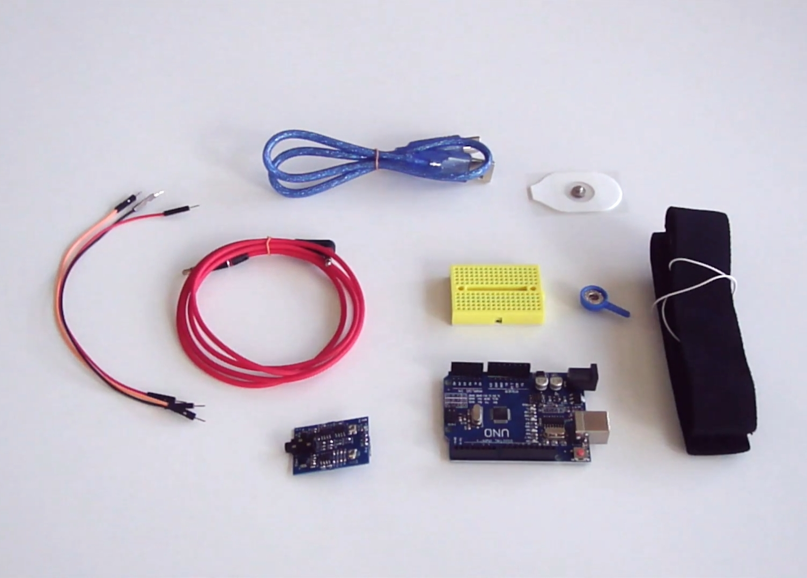
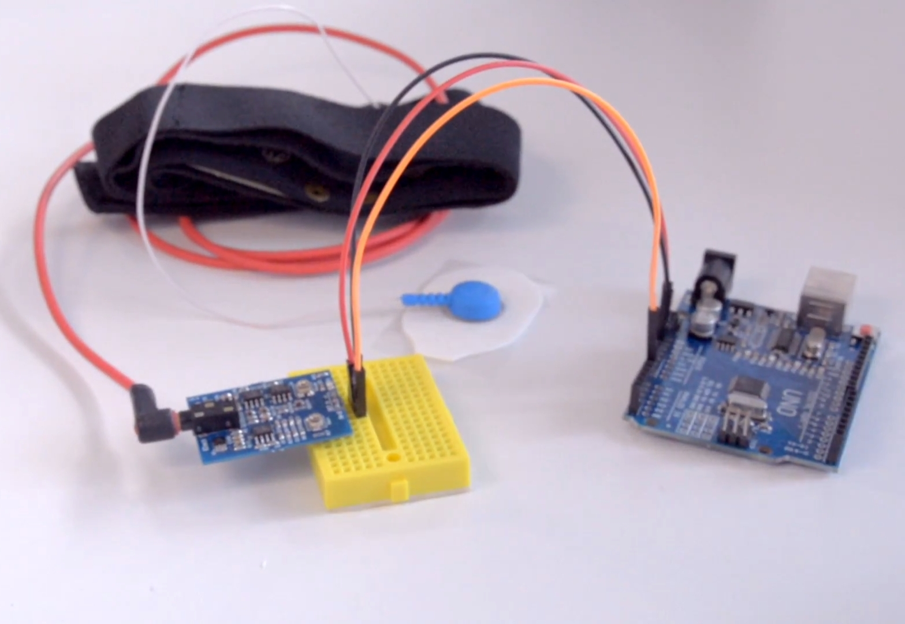
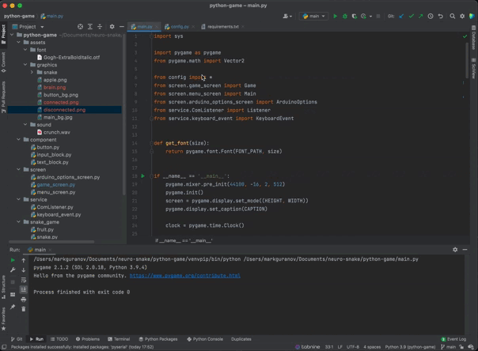
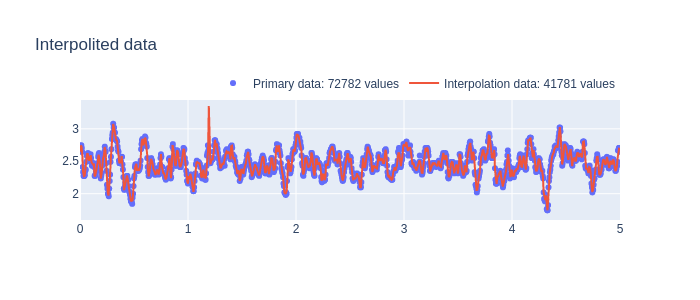
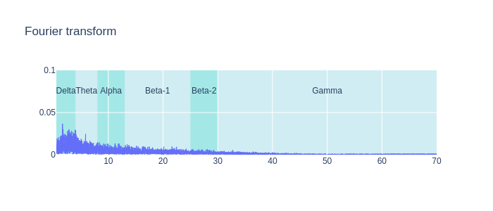
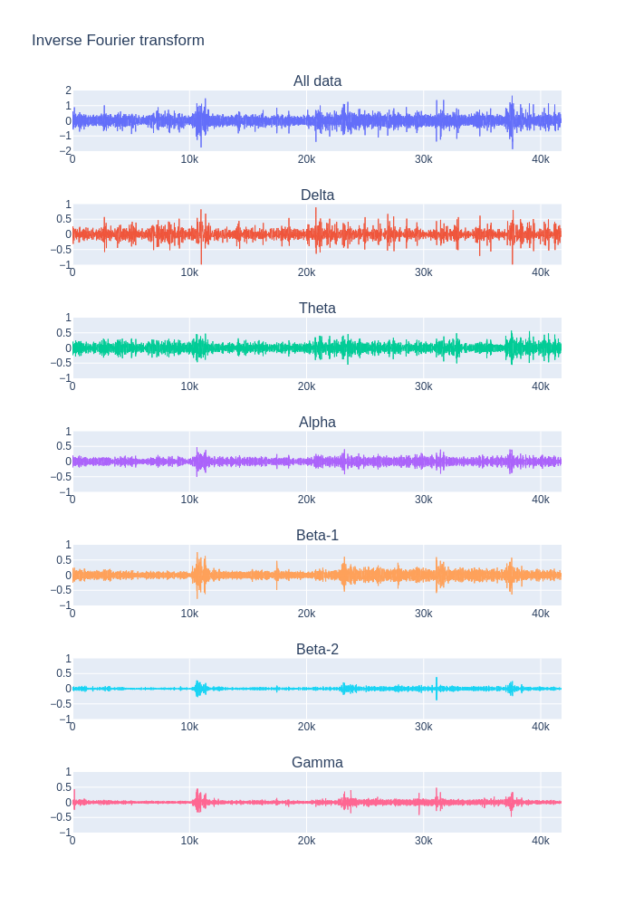

# neuro-snake

> A laboratory neurotechnology study that streams an Arduino-acquired EEG-like biosignal into a Snake game, maps higher activity to faster gameplay, and generates a post-session PDF report with signal interpolation and FFT-based brain-rhythm analysis.


[Русская версия](README.ru.md)

| Field | Value |
|---|---|
| Status | Finished educational demo |
| Type | Hardware-assisted game / signal-processing experiment |
| Primary stack | Python 3, pygame, pySerial, pandas, NumPy, SciPy, Plotly, FPDF, Arduino Uno |
| Controls | Keyboard direction controls |
| Optional input | Arduino serial stream from analog pins `A0` and `A1` |
| Runtime outputs | Snake gameplay; connected sessions can save CSV samples, generated plots, and a PDF report |

## Goal

This project was performed as part of a laboratory neurotechnology study. Core brain activity indicators were studied and applied to make a Snake game simulation dynamic: higher measured activity maps to faster gameplay.

The game direction is still controlled by the keyboard. The project does not implement direct thought control, and it does not make medical or diagnostic claims. When Arduino is connected, the Python game reads an EEG-like serial biosignal, uses the second serial value as the displayed/current movement-delay value, writes that value during gameplay, and generates a PDF report after the connected game ends.

The post-session report shows brain activity indicators across the game session. It includes signal interpolation, Fourier transform, inverse Fourier transform, and EEG band views for Delta, Theta, Alpha, Beta, and Gamma rhythms.

## Hardware setup

| Component | Evidence / expectation |
|---|---|
| Board | Arduino Uno or compatible board |
| Signal source | Analog EEG-like sensor/source connected to Arduino |
| Analog pins | `A0`, `A1` in `arduino-serial/eeg_reader/eeg_reader.ino` |
| Arduino library | `TimerOne` from `arduino-serial/lib/TimerOne.zip` |
| Serial format | Two comma-separated values mapped from Arduino analog reads to `0..255` |
| Game value used | Python currently uses the second serial value (`A1`) for speed display, movement delay, and CSV/report samples |
| Serial speed | `115200` baud |
| Default game port | `/dev/cu.usbmodem1411301`, editable in the game options screen |

Hardware photos:

 

## Software setup

The repository does not pin or document a tested Python patch version. `requirements.txt` pins `pygame==2.1.2`, so an older Python 3 environment may be required if modern Python versions cannot install that pygame release.

```sh
cd python-game
python -m pip install -r requirements.txt
python main.py
```

For hardware mode:

1. Install the Arduino `TimerOne` library.
2. Upload `arduino-serial/eeg_reader/eeg_reader.ino` to the board.
3. Connect the signal source to analog pins `A0` and `A1`.
4. Start the Python game and open the Arduino options screen.
5. Set the serial port and speed (`115200` by default), then connect.

The game can open without Arduino hardware. In that mode `Listener.read_data()` falls back to a hard-coded value, but CSV capture and report generation only run while the game is marked as connected.

## Repository layout

- `python-game/main.py` - pygame entrypoint.
- `python-game/requirements.txt` - Python dependency manifest.
- `python-game/snake_game/snake.py` - movement timing, speed display value, and connected-session data writing.
- `python-game/service/com_listener.py` - pySerial connection and serial sample reader.
- `python-game/service/data_service.py` - CSV capture lifecycle.
- `python-game/service/report_service.py` - interpolation, FFT, inverse FFT, charts, and PDF report generation.
- `arduino-serial/eeg_reader/eeg_reader.ino` - Arduino sketch reading `A0`/`A1` and writing serial samples.
- `arduino-serial/lib/TimerOne.zip` - Arduino TimerOne library archive.
- `assets/` - README/demo photos, GIF, signal-processing images, and sample report.
- `python-game/assets/` - runtime graphics, font, sound, and report visualization assets used by the game.

## Demo



## Signal processing and outputs

Connected gameplay writes time/value samples and creates a report after game over.

| Input / output | Path | Notes |
|---|---|---|
| Arduino sketch | `arduino-serial/eeg_reader/eeg_reader.ino` | Reads `A0`/`A1`, writes serial values at `115200` baud every `3000` microseconds |
| Runtime entrypoint | `python-game/main.py` | Start from `python-game/` so relative runtime asset paths resolve |
| Captured CSV | `python-game/resourcedata_<timestamp>.csv` | Actual current code path; `RESOURCE_PATH` is concatenated without a separator |
| Generated PDF | `python-game/resourcereport-<timestamp>.pdf` | Actual current code path; generated after a connected game session ends |
| Generated plots | `python-game/assets/visualization/interpolation.png`, `fourie.png`, `inverse_fourie.png` | Created/overwritten during report generation |
| Sample PDF | `assets/report-05.05.2022-20.00.40.pdf` | Preserved example output |
| README sample images | `assets/interpolation.png`, `assets/fourie.png`, `assets/inverse_fourie.png` | Static images used in this README |

Example report: [PDF](assets/report-05.05.2022-20.00.40.pdf)





## Features

- pygame Snake game engine.
- Keyboard direction controls.
- Optional Arduino serial connection via pySerial.
- Serial sample acquisition from Arduino analog pins.
- Movement-delay value derived from the second serial channel when connected.
- Signal interpolation and FFT-based frequency analysis for connected sessions.
- PDF report generation with charts after connected game over.

## Assumptions and limitations

- This is an educational demo, not a medical or diagnostic device.
- The project does not include a wiring diagram or freshly rerun hardware setup notes.
- Signal quality depends on sensor placement, board wiring, noise, and runtime environment.
- Direction control remains keyboard-based; serial values affect movement timing/speed display and report samples.
- The default serial port is macOS-specific and should be changed for each machine.
- Hardware execution was not rerun during README rollout.
- Python dependency versions are only partially pinned; `pygame` is pinned, the rest are not.
- Output file paths contain a historical path-concatenation quirk: generated CSV/PDF names are currently prefixed with `resource` rather than placed inside a `resource/` directory.

## Status

Research/educational project. Results, dependencies, hardware assumptions, and runtime notes are documented for reproducibility, but the repository is not maintained as a packaged product.
